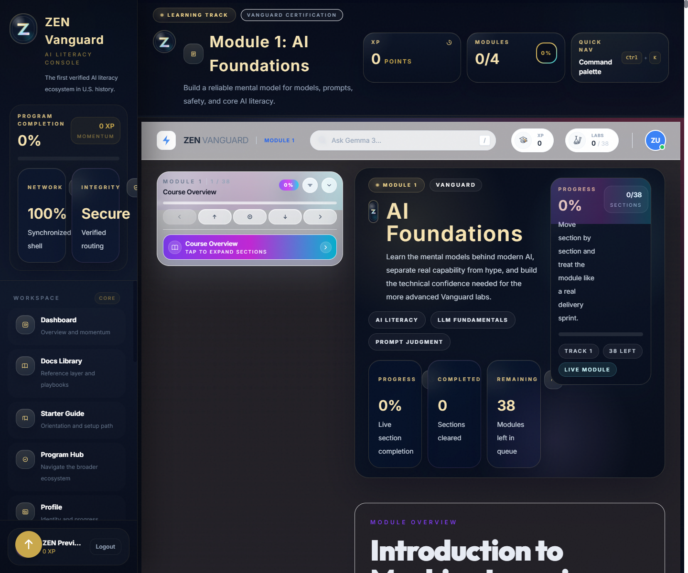
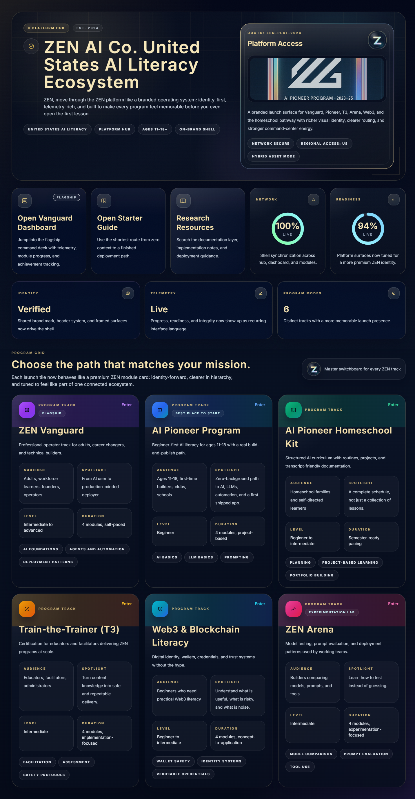
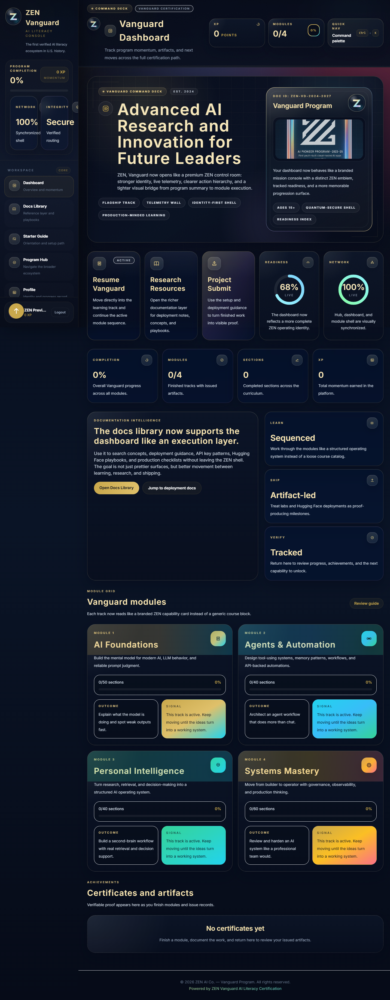

<div align="center">
  

  <h1>ZEN VANGUARD</h1>
  <p><strong>The Professional AI Literacy Platform</strong></p>

  <p>
    
    
    
    
    
  </p>
</div>

---

## The Program Behind the Platform

ZEN Vanguard is the professional evolution of the **first youth AI literacy program in United States history** — developed, deployed, and facilitated by **ZEN AI Co** in partnership with **Boys & Girls Clubs of America**. Now entering its **third year in 2026**, that foundational initiative has empowered thousands of young people across the country with the tools and mindset to navigate an AI-driven world.

ZEN Vanguard carries that mission forward for **professionals, entrepreneurs, and individuals** who refuse to be outpaced by change. This platform doesn't just explain AI — it immerses you in it. You'll develop working fluency with next-generation tools, workflows, and systems so you can move at the speed of innovation rather than fall behind it.

Whether you're leading a team, building a product, or simply committed to staying ahead — this is where serious practitioners come to get current.

---

## Platform Preview

<div align="center">
  
  <p><em>Module experience — immersive, interactive, structured for depth</em></p>
</div>

<div align="center">
  
  <p><em>Program Hub — your launchpad into the full curriculum</em></p>
</div>

<div align="center">
  
  <p><em>Learner Dashboard — track progress, XP, and completed labs</em></p>
</div>

---

## Curriculum

The Vanguard program is structured across four progressive modules. Each one builds on the last — from foundational literacy to advanced deployment patterns.

| Module | Title | Focus |
|--------|-------|-------|
| **01** | Foundations of Modern AI | How large language models work, prompt engineering, reasoning patterns, and responsible use |
| **02** | Agents & Automation Frameworks | Agent design, tool use, orchestration, memory, and API-backed workflows |
| **03** | Applied AI in the Real World | Production-grade use cases — from analysis pipelines to creative and business applications |
| **04** | Advanced Systems & Emerging Frontiers | Multimodal systems, enterprise architecture, AI ethics at scale, and what's coming next |

Every module includes:
- **Structured reading** with annotated examples and visual aids
- **Interactive labs** — hands-on exercises running live in the browser
- **AI-assisted search** — ask questions about the curriculum, get answers in context
- **Progress tracking** — XP, completion state, and section-level navigation

---

## Experience Design

ZEN Vanguard was built to the same standard we hold AI tools to: it should be fast, clear, and genuinely useful. No fluff.

- **Zero page loads between sections** — content streams in with scroll-triggered reveals
- **Persistent command center** — the sidebar navigation panel is your control hub: track completion, jump between sections, and navigate across modules
- **Keyboard-driven** — press `/` anywhere to open the command palette
- **Fully responsive** — desktop-first, mobile-aware
- **Glassmorphism design system** — dark-mode-ready with per-module accent theming

---

## Tech Stack

| Layer | Technology |
|-------|-----------|
| Framework | React 19 + TypeScript |
| Build | Vite 6 with manual chunk splitting |
| Routing | React Router 7 |
| Styling | Tailwind CSS + custom design tokens |
| AI Integration | Gemini 2.5 Flash (via server-side proxy) |
| Auth & Data | Supabase |
| Payments | Stripe |
| Hosting | Vercel / static host + Node API |

---

## Getting Started

### Prerequisites

- Node.js 18+
- npm or pnpm

### Installation

```bash
# Clone the repository
git clone https://github.com/Bluenot3/V3.git
cd V3

# Install dependencies
npm install

# Copy .env.example to .env.local
# Then add your API keys and deployment values there
```

### Development

```bash
# Start frontend + API server together
npm run dev:full

# Frontend only
npm run dev

# API only
npm start
```

Open `http://localhost:3000`

### Production Build

```bash
npm run check
npm run build
npm run preview
```

---

## Environment Variables

### Frontend-safe (VITE_ prefix)

| Variable | Description |
|----------|-------------|
| `VITE_SUPABASE_URL` | Your Supabase project URL |
| `VITE_SUPABASE_PUBLISHABLE_KEY` | Supabase anon key |
| `VITE_STRIPE_PUBLISHABLE_KEY` | Stripe publishable key |
| `VITE_API_BASE_URL` | Backend API base URL |
| `VITE_ENABLE_DEMO_LOGIN` | `false` in production |

The API server now loads `.env`, `.env.local`, and `.env.<NODE_ENV>` in that order, so local overrides can stay out of committed defaults.

### Server-only (never expose to client)

| Variable | Description |
|----------|-------------|
| `STRIPE_SECRET_KEY` | Stripe secret key |
| `STRIPE_WEBHOOK_SECRET` | Stripe webhook signing secret |
| `STRIPE_PRICE_ID` | Subscription price ID |
| `ADMIN_BYPASS_USERNAME` | Admin access username |
| `ADMIN_BYPASS_PASSWORD` | Admin access password |

---

## Publish Readiness

This release includes a final publish surface for static deployment and richer link previews:

- Route-aware document titles and descriptions
- Custom `404` experience instead of a blind redirect
- Web manifest, favicon, and Open Graph image under `public/`
- Safer API defaults for CORS normalization, Stripe redirect origin handling, and email endpoint failures

If you deploy the API separately from the frontend, make sure `VITE_API_BASE_URL` points at the live API origin and that `CORS_ORIGINS` is set explicitly on the server.

---

## Project Structure

```
public/                  # Favicon, manifest, robots, social preview assets
src/
├── components/          # Shared UI components
│   └── vanguard/        # Core platform components (Frame, NavCard, Footer)
├── modules/
│   ├── module1/         # Foundations of Modern AI
│   ├── module2/         # Agents & Automation Frameworks
│   ├── module3/         # Applied AI in the Real World
│   └── module4/         # Advanced Systems & Emerging Frontiers
├── pages/               # Route-level page components
├── hooks/               # Shared hooks (auth, module experience, scroll)
├── types/               # Global TypeScript types
└── assets/              # Static assets and icons
```

---

## API Server Endpoints

| Method | Endpoint | Description |
|--------|----------|-------------|
| `GET` | `/api/health` | Health check |
| `POST` | `/api/ai/generate` | AI proxy (server-side key) |
| `GET` | `/api/billing/status` | Subscription status |
| `POST` | `/api/stripe/create-checkout-session` | Start checkout |
| `POST` | `/api/stripe/webhook` | Stripe webhook handler |

---

## About ZEN AI Co

ZEN AI Co is an AI education and advisory organization committed to building AI literacy at every level — from youth programs to professional development. Founded on the belief that access to AI fluency should not be gated by background or budget, ZEN has been at the forefront of applied AI education since before it became a headline.

**Our work:**
- Launched the first youth AI literacy program in U.S. history with Boys & Girls Clubs of America
- Delivered curriculum and training to thousands of learners across the country
- Built ZEN Vanguard as the professional-grade extension of that same mission

---

<div align="center">
  <p>Built with intention. Designed for the pace of now.</p>
  <p><strong>ZEN AI Co &copy; 2026</strong></p>
</div>
